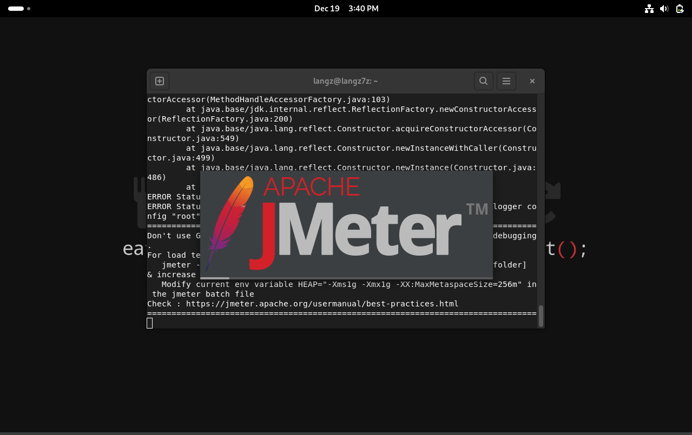

# Laporan Instalasi Apache JMeter di Debian 12

Panduan ini menjelaskan langkah-langkah untuk menginstal Apache JMeter pada sistem operasi Debian 12. Apache JMeter adalah alat pengujian kinerja berbasis Java yang banyak digunakan untuk menguji aplikasi web dan berbagai layanan lainnya.

---

## Prasyarat

Sebelum memulai instalasi, pastikan Anda memiliki:

- Sistem operasi **Debian 12** yang sudah berjalan.
- Hak akses root atau pengguna dengan akses sudo.
- **Java** (minimal versi 8) sudah terinstal pada sistem.

---

## Langkah-langkah Instalasi

### 1. Update Sistem

Perbarui repositori paket dan pastikan semua paket terbaru telah terinstal:

```bash
sudo apt update && sudo apt upgrade -y
```

### 2. Instal Java

Apache JMeter memerlukan Java untuk berjalan. Instal OpenJDK dengan perintah berikut:

```bash
sudo apt install openjdk-21-jdk -y
```

Verifikasi instalasi Java:

```bash
java -version
```

Output yang diharapkan:

```plaintext
openjdk version "21.0.5" 2024-10-15
OpenJDK Runtime Environment (build 21.0.5+11-Debian-1)
OpenJDK 64-Bit Server VM (build 21.0.5+11-Debian-1, mixed mode, sharing)
```

### 3. Unduh Apache JMeter

Unduh versi terbaru Apache JMeter dari situs resmi:

```bash
wget https://dlcdn.apache.org//jmeter/binaries/apache-jmeter-5.6.2.tgz
```

> **Catatan:** Periksa [situs resmi Apache JMeter](https://jmeter.apache.org/) untuk versi terbaru jika perlu.

### 4. Ekstrak File JMeter

Ekstrak file tar.gz yang telah diunduh:

```bash
tar -xvzf apache-jmeter-5.6.3.tgz
```

Pindahkan folder hasil ekstraksi ke direktori yang diinginkan, misalnya `/opt`:

```bash
sudo mv apache-jmeter-5.6.2 /opt/jmeter
```

### 5. Konfigurasi Variabel Lingkungan

Tambahkan JMeter ke variabel lingkungan PATH agar mudah dijalankan dari terminal:

```bash
echo 'export PATH=$PATH:/opt/jmeter/bin' >> ~/.bashrc
source ~/.bashrc
```

### 6. Verifikasi Instalasi

Jalankan JMeter untuk memastikan instalasi berhasil:

```bash
jmeter
```

Jika berhasil, antarmuka grafis (GUI) JMeter akan muncul.


---

## Menjalankan JMeter dalam Mode Non-GUI

Untuk pengujian dalam mode Non-GUI (lebih hemat sumber daya):

```bash
jmeter -n -t <file_test_plan>.jmx -l <file_output>.jtl
```

Contoh:

```bash
jmeter -n -t test_plan.jmx -l result.jtl
```

---

## Penyelesaian Masalah

1. **Masalah Java tidak komtibel**
   - Pastikan Java yang terinstall menggunakan versi yg terbaru.

2. **JMeter Tidak Dapat Dijalankan:**
   - Pastikan direktori instalasi sudah benar dan PATH sudah ditambahkan dengan benar.

---

## Referensi

- [Dokumentasi Resmi Apache JMeter](https://jmeter.apache.org/)
- [Repositori Debian](https://www.debian.org/)

---

Semoga panduan ini membantu Anda dalam menginstal dan menjalankan Apache JMeter di Debian 12. Jangan ragu untuk memberikan saran atau melaporkan masalah melalui fitur Issue di repositori ini.
